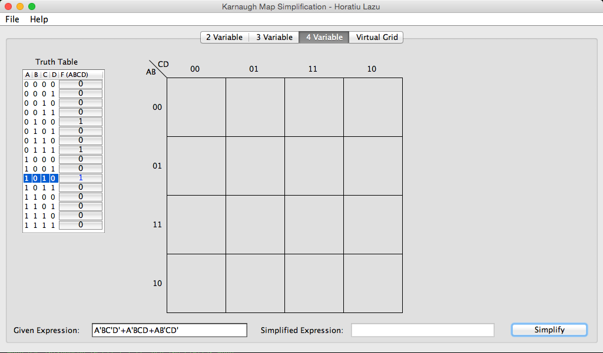

#Karnaugh-Map-Simplifier

##Purpose
The purpose of this application is to simplify boolean expressions. It accomplishes the simplification using Quine-McClusky for expressions over 4 variables, and Karnaugh Map for expressions with 4 or less variables. Feel free to contribute! 

##Unique Karnaugh Map simplification algorithm
This application makes use of algorithms and data-structures to power a pattern recognition engine. For Karnaugh Maps, this application uses a unique non-standardized algorithm. Here's a quick overview of the steps:

1. Gather required information from truth-table and generate matrix and SOP (Sum of Product) expressions
	* Bitwise operators can make this easier/faster
2. Indicate all `1`'s in the truth-table with a value of `1` in the matrix
3. Generate `2D prefix sum` array from the matrix
	* `Prefix sums` are a powerful technique dervived from the fundemental theorem of calculus
	* The idea of `prefix sums` are similar to integration in calculus - finding the area (sum) under a curve
	* We integrate the results and use `ƒ(b) - ƒ(a)` to quickly find the sum, allowing us to have `O(1)` summation
	* We can further apply the `principle of inclusion-exclusion` to extend prefix sums to be 2D
4. Traverse through array, and for every `1` value execute the group finding algorithm
5. Group finding algorithm involves going from `[-1, N]` where N = # of columns or rows, and checking to see if the prefix sum is equal to `x * y`.
	* The reason we go from [-1, N] is because you can have overlap to the other side of the Karnaugh Map
	* Prefix Sums are a powerful technique as you can figure out if you can form a grouping in `O(1)` complexity since if there are pairs there, the following is true: `prefixSum(x1, y1, x2, y2) == (abs(x1-x2)+1)*(abs(y1-y2)+1)`!
	* Through some tricky careful implementation with prefix sums this will account for all cases
	* Special note needs to be taken for the 4 corners case
6. Store all the `groupings` in a special `disjoint set`
	* The advantage of disjoint sets is that you can find duplicates quickly, and merge them quickly
	* The ideal disjoint set used here is quick-union with path compression and union-by-rank
	* Path compression allows to minimize the distance from the nodes to the root by making it a length of `1` upon a `merge` or `find`
	* Union-by-rank decreases the depth of the tree by appending smaller trees below larger trees (hence rank)
7. Store all `groupings` in a `PriorityQueue`
	* Priority queue to store orders
	* The ordering is established based off of the size of `(abs(x1-x2)+1)*(abs(y1-y2)+1)`, the size of the grouping
	* In case of ties, greedily assign them to squares
8. Store a `hashset` that indicates if a grouping was already made, and if it was merge the current coordinate pointer to that disjoint set
	* In case it was not made, push the new group and create disjoint set
9. Pop the priority queue until you get to a valid grouping not yet occupied
10. Add final grouping to an answer (`LinkedList`)
11. Continue processing the rest of the grid, and by the end you have a LinkedList with all the groupings!
12. Output groupings onto grid, be careful of wrapping cases, use `drawArc` and `drawRoundRect` where appropriate; use a circularly linked list to traverse colors for RGB and increment pointer each time

##Features proposed
* Allow simplification of boolean expressions from truth-table
* Permit SOP or POS conversion (possible)
* Use Quine McCluskey method of simplification, with branch-and-bound method
* Show pairing visualization for up to 4 variables
* Allow for mapping of pairings and SOP determination

##Completed
* Truth Table to SOP expressions
* Truth Table to matrix
* Complete user interface with Swing
* Basic grouping graphics
* Algorithmic design for solving up to 4 variables

##Screenshot

